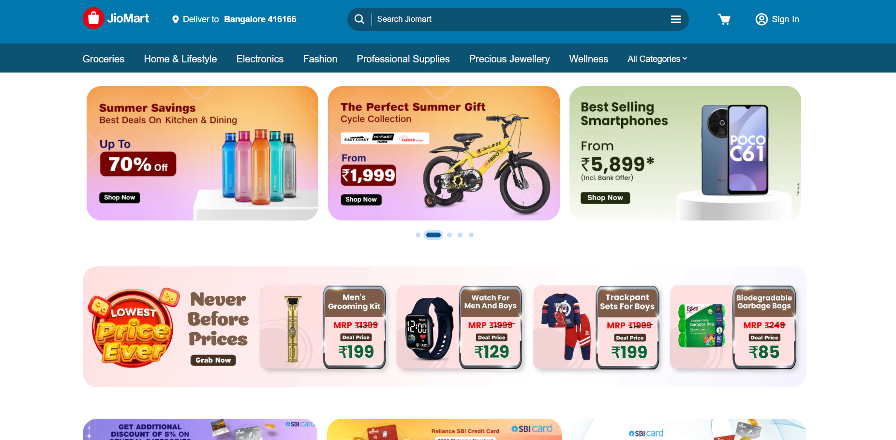
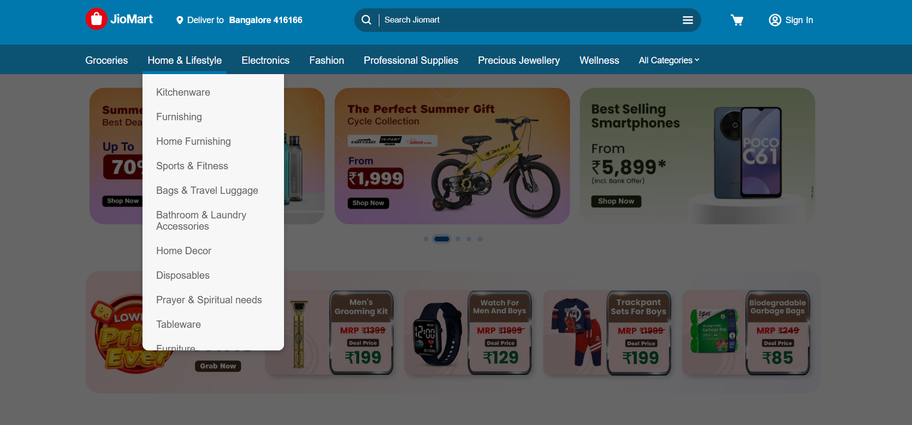

# JioMart Clone

A responsive and modern clone of JioMart's e-commerce website built with HTML, CSS, and JavaScript.

[Live Demo](https://jiomart-clone-web.vercel.app/)

## Project Overview

This project is a frontend implementation of JioMart, India's popular online shopping platform. The clone replicates the UI/UX of JioMart's website with responsive design and interactive elements.

## Features

- **Responsive Design**: Fully responsive layout that works on desktop, tablet, and mobile devices
- **Interactive UI Elements**: Carousel sliders, product cards, and navigation menus
- **Modern UI**: Clean and intuitive interface following JioMart's design principles
- **Product Categories**: Organized display of various product categories
- **Footer Navigation**: Comprehensive footer with links to important pages

## Technologies Used

- HTML5
- CSS3
- JavaScript
- Boxicons for icons
- Font Awesome for additional icons

## Project Structure

```
/
├── css/
│   ├── style.css       # Global styles
│   ├── header.css      # Header styles
│   └── main.css        # Main content styles
├── images/
│   ├── electronics/    # Product images
│   ├── favicon/        # Favicon icons
│   ├── main-banner/    # Banner images
│   ├── off-banner/     # Offer banner images
│   ├── scroll-container/ # Carousel images
│   └── sub-banner/     # Sub-banner images
├── js/
│   └── main.js         # Main JavaScript functionality
├── index.html          # Main HTML file
└── README.md           # Project documentation
```

## Getting Started

### Prerequisites

- Any modern web browser (Chrome, Firefox, Safari, Edge)

### Installation

1. Clone the repository

2. Open the project folder

3. Open `index.html` in your browser or use a local server

## Screenshots

### Main Page


### Dropdown Menu


## Future Improvements

- Add product detail pages
- Implement shopping cart functionality
- Add user authentication
- Create checkout process
- Implement search functionality


## Acknowledgments

- JioMart for the design inspiration
- Boxicons and Font Awesome for the icons
- Unsplash/Pexels for placeholder images (if used) 